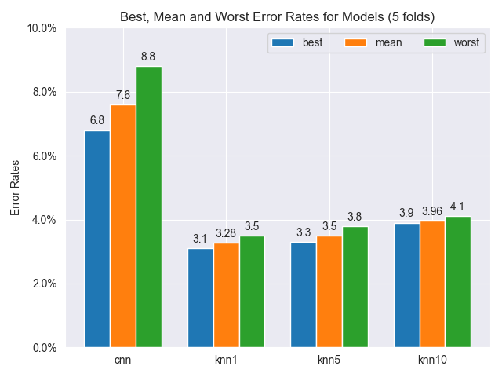
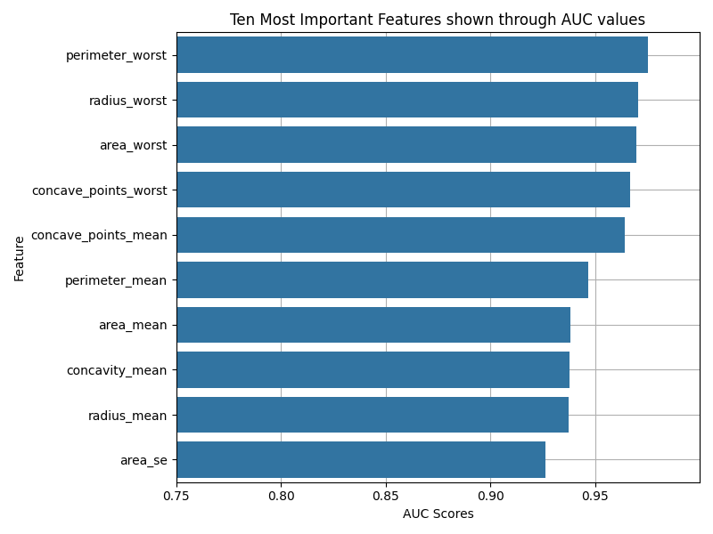
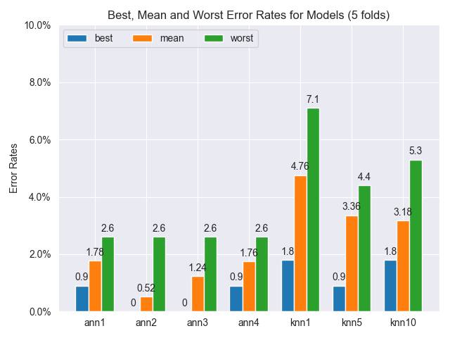
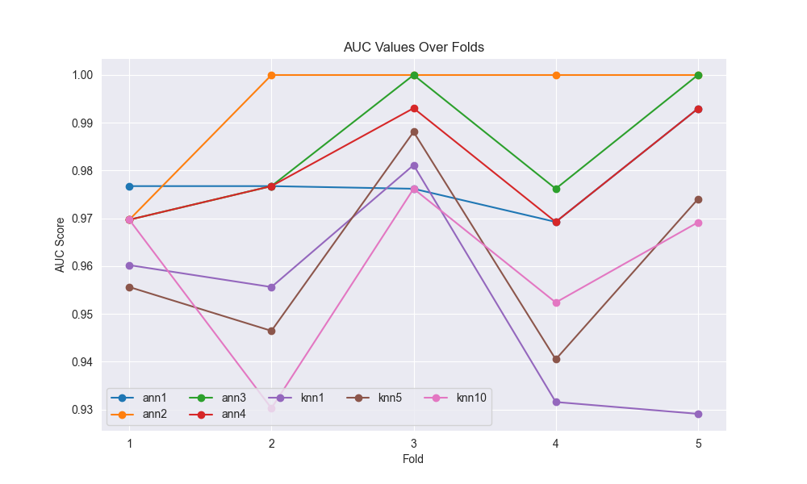

# **CSCI444:Machine Learning Assignment #3** 
Owen Shay
202006664

x2020gft@stfx.ca 

December 1st, 2023

## Dataset and setting up the data

> Just as in previous assignments, I am working on the MNIST handwritten digits dataset, but in this case I am evaluating models on all the digits from 0-9, rather than just the 8's and 9's. 

> The data was formatted in a .mat file, and accessed through the 'loadmat' function, storing the data in a dictionary:

    path = Path(__file__).resolve()
    numRecogData = loadmat((path.parent / "NumberRecognitionBiggest.mat").resolve())

> And the dataset was preprocessed to work with the CNN architecture:

    train = np.array(matFile["X_train"])
    labels = np.array(matFile["y_train"])
    test = np.array(matFile["X_test"])

    train = train.astype("float32") / 255
    test = test.astype("float32") / 255
    test = np.expand_dims(test, -1)

    labels = labels.transpose(1, 0).reshape(40000)

# Question #1

> I started by building the model using Sequential and compiling the blueprint:

    model = Sequential(
        [
            Conv2D(
                1,
                kernel_size=3,
                input_shape=(28, 28, 1),
                activation="linear",
                data_format="channels_last",
                padding="same",
                use_bias=True,
            ),
            ReLU(),
            BatchNormalization(),
            Flatten(),
            Dense(NUM_CLASSES, activation="softmax"),
        ]
    )

    model.compile(
        loss="sparse_categorical_crossentropy",
        optimizer="adam",
        metrics=["accuracy"],
    )

> Then added all the models to a list to loop through and their respective names to train/test:

     models = [
        model,
        KNeighborsClassifier(n_neighbors=1),
        KNeighborsClassifier(n_neighbors=5),
        KNeighborsClassifier(n_neighbors=10),
    ]

    classifiersLabeled = ["cnn", "knn1", "knn5", "knn10"]

> And made a dataframe to store the mean error rates for each model over K folds, as well as lists to store the best, worst and mean error rates for each model: 

    errorRates = [[], [], [], []]
    bestErrorRate = [0, 0, 0, 0]
    meanErrorRate = [0, 0, 0, 0]
    worstErrorRate = [0, 0, 0, 0]

    kfold_scores = pd.DataFrame(
        index=["cnn", "knn1", "knn5", "knn10"],
        columns=["fold1", "fold2", "fold3", "fold4", "fold5", "mean"],
        data=0.0,
    )

    kfold_scores["classifier"] = kfold_scores.index
    kfold_scores.set_index("classifier", inplace=True)
    kf_score = []

> With these lists, I looped through and ran Stratified K-Fold cross validation on each model to evaluate performance:
    StratKFold = StratifiedKFold(5, shuffle=True, random_state=40)

    for i in range(len(models)):
        curClassifier = models[i]

        if classifiersLabeled[i] == "cnn":
            curClassifier.summary()
            cnnData = np.expand_dims(train, -1)

            for j, (train_index, test_index) in enumerate(StratKFold.split(cnnData, labels)):
                curClassifier.fit(
                    cnnData[train_index],
                    labels[train_index],
                    batch_size=8,
                    epochs=1,
                    validation_split=0.1,
                )
                score = curClassifier.evaluate(cnnData[test_index], labels[test_index], verbose=1)
                err = round(1 - score[1], 3)

> Since KNN and CNN require different input shapes for the images, I ran two different loops for the two types of models:

        else:
            knnData = train.reshape(40000, 784)

            for j, (train_index, test_index) in enumerate(StratKFold.split(knnData, labels)):
                curClassifier.fit(knnData[train_index], labels[train_index])
                preds = curClassifier.predict(knnData[test_index])

                score = accuracy_score(preds, labels[test_index])
                err = round(1 - score, 3)

> And here are the results:

| classifier   |   fold1 |   fold2 |   fold3 |   fold4 |   fold5 |   mean  |
|:-------------|--------:|--------:|--------:|--------:|--------:|--------:|
| cnn          |   0.088 |   0.080 |   0.075 |   0.068 |   0.069 |  0.0760 |
| knn1         |   0.034 |   0.033 |   **0.031** |   0.035 |   **0.031** |  &#9733;0.0328 |
| knn5         |   0.036 |   0.038 |   0.034 |   0.033 |   0.034 |  0.0350 |
| knn10        |   0.039 |   0.041 |   0.039 |   0.040 |   0.039 |  0.0396 |

|  Model  |  Mean Error  | 
|:--------|:--------:|
|CNN |7.60%|
|KNN (1 neighbor)|&#9733;3.28%|
|KNN (5 neighbors)|3.50%|
|KNN (10 neighbors)|3.96%|

### Which classifier performs the best in this task?

> As seen above, the K Nearest Neighbors model with K=1 outperforms all other models in this task, with a mean error rate of 3.28%. It also contains the highest scoring folds out of all models, scoring an error of 3.1% error on 2 of 5 folds.

### Why do you think the underperforming classifiers are doing more poorly?

> The KNN models are all performing fairly well in comparison with eachother, the only classifier shown to be severely underperforming is the CNN. This can be attributed to how simple the layer architecture is. 

> The model uses one 2D convolutional layer with a simple linear activation function and one output channel, responsible for running a 2D convolutional filter over images. It is then followed with a ReLU activation layer, which introduces non-linearity to the model, and then a batch normalization layer to normalize the activation functions of previous layers. The 2D data is then flattened to 1D to prepare it for the dense output layer. 

> This CNN would perform much better and would most likely be the highest scoring model if more layers were added and the parameters were fine tuned for this task, as well as changing the batch size (how many training samples does it take in per iteration), adding more out channels (the number of filters in a convolutional layer) and adding more epochs (the number of passes through the entire dataset). 

# **Question #2**

## **Dataset Description**
>The dataset I've chosen to use is on breast cancer, formally named the [Breast Cancer Wisconsin (Diagnostic) Dataset](https://www.kaggle.com/datasets/yasserh/breast-cancer-dataset/data). This dataset contains 569 samples with 32 measurements each. Ten of these measurements are unique, and the others are products of further data analysis (ex. radius mean, radius standard error and "worst" radius (worst is the mean of the three largest values present in the sample) are all calculated). 

>These ten features are computed for each cell nucleus: 
1. <u>Radius</u> of distances from center to points on the perimeter. 
2. <u>Texture</u> which is the standard deviation of grey-scale values obtained from x-ray. 
3. <u>Outer Perimeter </u> which is the size of the core tumor.
4. <u>Area</u> of the lobes.
5. <u>Smoothness</u> which is the local variation in radius lengths. 
6. <u>Compactness</u> in lobe structure (calculated using perimeter^2 / area - 1.0). 
7. <u>Concavity</u> which is the severity of concave portions of the contour. 
8. <u>Number of Concave Points</u> which is the number of concave portions of the contour. contour in benign mass is round and oval, and the contour in a malignant mass is irregular and spiculated. 
9. <u>Symmetry</u> of lobe structure. 
10. <u>Fractal Dimension</u> which is a quantification of the complex geometry present within the breast masses at various scales/zoom sizes (calculated using the "coastline approximation" - 1, which is an approximation technique used to represent intricate features of coastlines (or in this case breast cells) in a simplified way).

>The rest are products of these ten, 3 for each measure (mean, standard error and worst) totalling up to 30 measurements, an ID value and a label for each sample.

>The nature of the groups of interest/not of interest is whether or not the tumor present in the breast is malignant (cancerous); denoted as 'M'; or benign (non-cancerous), denoted as 'B'. There are many different combinations of features that all work together in classifying if a tumor is malignant or benign, for example malignant tumors usually have a abnormally high radius and outer perimeter mean values, while benign tumors usually have lower values across the board. 

>Sample counts for the malignant tumors is 212 samples, making up 37% of all samples. The count of benign tumors is 357 samples, making up 63% of all samples. 

> Here is how I have preprocessed the data:

    df = pandas.read_csv("breast-cancer.csv.xls")
    df = df.drop(["id"], axis=1) 
    df["diagnosis"] = df["diagnosis"].replace({"M": 1, "B": 0})

    testingData = df.drop(["diagnosis"], axis=1)
    labels = df["diagnosis"]

> I have normalized this data into a range between 0-1 using sklearns MinMaxScaler function:

    for i in testingData:
        testingData[i] = MinMaxScaler().fit_transform(testingData[i].values.reshape(-1, 1))

## **AUC Values and Analysis**
>Here are the top ten results after analyzing each measurement individually and calculating their AUC scores:

|        Feature        |  AUC  |
|:----------------------|:-----:|
| Worst Perimeter            | 0.975 |
| Worst Radius            | 0.970 |
| Worst Area                | 0.970   |
| Worst Concave Points                  | 0.967   |
| Mean Concave Points                 | 0.964   |
| Mean Perimeter                   | 0.947   |
| Mean Radius                  | 0.938   |
| Mean Area                  | 0.938   |
| Mean Concavity                  | 0.938   |
| Area Standard Error            | 0.926 |

> And visualized through this plot, showing the importance of each feature through their respective AUC scores:

> These AUC scores show which measurements have the most potential to inform prediction within the model. This shows that the Worst Perimeter; or the mean of the largest 3 breast mass perimeter values found in a sample; is the top feature for predicting if a tumor is malignant in this dataset. All of these ten feature's AUC values are very close and all show great potential to inform the predictions as well.

# Question #3

> Firstly, I initialized 4 ANN's with different architectures to test alongside the KNN models:

> The ANNs share similar parameters, but they are all unique in different ways. Adam was by far the highest performing solver out of the options, so I chose to use that in each model. I also had each model perform a "warm start", meaning that it takes the solutions from the previous iteration and uses them as the input layer for the next iteration, which boosted performance aswell. 

     ann1 = MLPClassifier(
        hidden_layer_sizes=(50),  # starting with 1 layer of 50 neurons
        solver="adam",
        activation="tanh",
        max_iter=1000,
        random_state=40,
        warm_start=True,  # reuses last call's solutions as initial input layer
        epsilon=1e-3,
    )

> The first ANN uses one layer of neurons in the hidden layer, tanh activation function and I changed the epsilon value to a higher value than default. The epsilon value plays a big part in the functioning of the adam optimizer because adam uses two "moments"; adam takes the mean of the gradients and the variance of the gradients to optimize itself through iterations, which are called moments, used to converge to a solution. Since the second moment is used as a divisor to the learning rate, as the second moment approaches zero it could lead to a division by zero error. To counteract this, we add the epsilon value to act as a threshold for the denominator to ensure non-zero divison. 

    ann2 = MLPClassifier(
        hidden_layer_sizes=(100, 50),  # doubling hidden layer size, adding an extra layer of neurons
        solver="adam",
        activation="relu",  # switching to relu activation
        max_iter=1000,
        random_state=40,
        warm_start=True,
        alpha=0.00001,  # changing L2 regularization term's strength to 10x weaker than base
        epsilon=1e-12,
    )

> The second ANN has two layers of neurons in the hidden layer, and I changed the activation function to ReLU rather than tanh, as tanh has the downside of saturating the data, snapping high values to 1 and low values to -1, and is really only sensitive to the mid-range data. ReLU is an incredible activation function, as it allows stochastic gradient descent because it resembles a linear activation function, but it is actually a non-linear function, which allows complex relationships in the data to be learned. I also changed the alpha parameter to a lower value; which is the L2 regularization term, responsible for a part of penalizing the loss function; penalizing larger weights more. 

    ann3 = MLPClassifier(
        hidden_layer_sizes=(200, 100, 50),  # doubling first layer again, adding 1 neuron layer
        solver="adam",
        activation="relu",
        max_iter=1000,
        random_state=40,
        warm_start=True,
        alpha=0.001,  # changing L2 regularization term's strength to 10x stronger than base
        epsilon=1e-2,
    )

> The third ANN introduces another layer of neurons, and sticks with the adam-ReLU setup. The alpha and epsilon parameters were changed to much higher values, penalizing lower weights more and setting the convergence threshold higher.

    ann4 = MLPClassifier(
        hidden_layer_sizes=(400, 200, 100),  # doubled neurons for each layer compared to previous
        solver="adam",
        activation="identity",  
        max_iter=1000,
        random_state=40,
        warm_start=True,
        alpha=0.001,
        epsilon=1e-2,
    )

> The final ANN has doubled the amount of neurons in each of the three hidden layers compared to the previous, and I changed the activation function to the identity function, also called the linear function, which is essentially no activation function as it passes along the input to the next layer unchanged. alpha and epsilon values are unchanged from the previous.

> These models as well as the KNNs were stored in a list to loop through:

    classifiers = [
        ann1,
        ann2,
        ann3,
        ann4,
        KNeighborsClassifier(n_neighbors=1),
        KNeighborsClassifier(n_neighbors=5),
        KNeighborsClassifier(n_neighbors=10),
    ]

    classifiersLabeled = ["ann1", "ann2", "ann3", "ann4", "knn1", "knn5", "knn10"]

> Then I initialized the lists and dataframe to store the scores over the K folds:

    errorRates = [[], [], [], [], [], [], []]
    bestErrorRate = [0, 0, 0, 0, 0, 0, 0]
    meanErrorRate = [0, 0, 0, 0, 0, 0, 0]
    worstErrorRate = [0, 0, 0, 0, 0, 0, 0]

    kfold_scores = pd.DataFrame(
        index=["ann1", "ann2", "ann3", "ann4", "knn1", "knn5", "knn10"],
        columns=["fold1", "fold2", "fold3", "fold4", "fold5", "mean"],
        data=0.0,
    )

    kfold_scores["classifier"] = kfold_scores.index
    kfold_scores.set_index("classifier", inplace=True)
    kf_score = []

> I went about testing and scoring the models with my data very similarly to the way I did in question 1:

    StratKFold = StratifiedKFold(5)

     for i in range(len(classifiers)):
        curClassifier = classifiers[i]

        for j, (train_index, test_index) in enumerate(StratKFold.split(data, labels)):
            curClassifier.fit(data.iloc[train_index], labels.iloc[train_index])
            preds = curClassifier.predict(data.iloc[test_index])

            score = accuracy_score(preds, labels.iloc[test_index])
            err = round(1 - score, 3)

> And here are the results:

| classifier   |   fold1 |   fold2 |   fold3 |   fold4 |   fold5 |   mean  |
|:-------------|--------:|--------:|--------:|--------:|--------:|--------:|
| ann1          |   0.018 |   0.018 |   0.018 |   0.026 |   0.009 |  0.0178 |
| ann2          |   0.026 |   **0.000** |   **0.000** |   **0.000** |   **0.000** |  &#9733;0.0052 |
| ann3          |   0.026 |   0.018 |   **0.000** |   0.018 |   **0.000** |  0.0124 |
| ann4          |   0.026 |   0.018 |   0.009 |   0.026 |   0.009 |  0.0176 |
| knn1         |   0.044 |   0.044 |   0.018 |   0.061 |   0.071 |  0.0476 |
| knn5         |   0.044 |   0.044 |   0.009 |   0.027 |   0.034 |  0.0336 |
| knn10        |   0.026 |   0.053 |   0.018 |   0.035 |   0.027 |  0.0318 |

|  Model  |  Mean Error  | 
|:--------|:--------:|
|ANN1 |1.78%|
|ANN2 |&#9733;0.52%|
|ANN3 |1.24%|
|ANN4 |1.76%|
|KNN (1 neighbor)|4.76%|
|KNN (5 neighbors)|3.36%|
|KNN (10 neighbors)|3.18%|

> I also plotted the AUC values for each model over the folds:

## Which ANN configuration that you tried worked best in your application? Why do you think it worked better than the other options you evaluated? 

> The second configuration of ANNs performed the best, scoring a 99.48% accuracy, which is the best score I've had on this dataset to date. I believe that it outperformed the other models mainly due to the number of neurons in the hidden layer, as well as the amount of neuron layers present. This amount of neurons and layers allows for complexity in the data to be learned, while not going too far and overfitting the model to the data. 

> The alpha and epsilon parameters also played a factor in the models strong performance. The alpha parameter at a smaller value gives a larger penalty to large weights, which was shown to be effective with this data, and the epsilon value sets a small threshold for convergence, allowing the model to train until it reaches a high accuracy. 